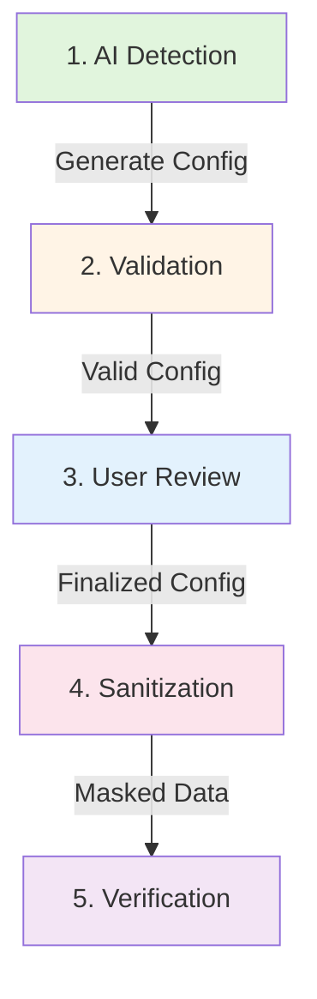

# Database Sanitization Workflow Guide

## 📋 Table of Contents
- [What is This Project?](#what-is-this-project)
- [Prerequisites](#prerequisites)
- [Installation](#installation)
- [Workflow Overview](#workflow-overview)
- [Step-by-Step Usage Guide](#step-by-step-usage-guide)
- [Configuration Reference](#configuration-reference)
- [Troubleshooting](#troubleshooting)
- [Best Practices](#best-practices)

---

## 🎯 What is This Project?

The **Database Sanitization Framework** is a comprehensive Python-based solution for identifying, masking, and managing Personally Identifiable Information (PII) in Microsoft SQL Server databases.

### Key Capabilities

1. **AI-Powered PII Detection**
   - Automatically identifies PII columns using GitHub Copilot API
   - Analyzes database schema across all tables and columns
   - Provides reasoning for detected PII columns

2. **Intelligent Data Masking**
   - Smart Generation: Format-adaptive masking that respects column constraints
   - Deterministic masking: Same input always produces same output (preserves FK integrity)
   - No truncation: All fake values guaranteed to fit within column length limits
   - Supports multiple PII types: emails, phones, names, SSNs, addresses, dates, and more
   - **⚠️ IRREVERSIBLE**: In-place updates, no mapping tables - backup required for recovery

3. **Validation & Safety**
   - Pre-sanitization configuration validation
   - Schema verification against database structure
   - Warnings for primary keys, foreign keys, and nullable constraints

### Domain Agnostic
Works across healthcare, retail, finance, e-commerce, education, and any other domain with PII data.

---

## 🔧 Prerequisites

### Software Requirements

| Component | Version | Purpose |
|-----------|---------|---------|
| **Python** | 3.10 or higher | Core runtime |
| **Microsoft SQL Server** | 2016+ or Azure SQL | Target database |
| **ODBC Driver 17 for SQL Server** | Latest | Database connectivity |
| **GitHub Copilot API Access** | Active subscription | AI-powered PII detection |

### System Requirements

- **Operating System**: Windows, Linux, or macOS
- **RAM**: 4GB minimum, 8GB recommended for large databases
- **Disk Space**: 500MB for framework and temp files
- **Network**: Reliable connection to SQL Server and GitHub API

### Database Permissions

The database user needs the following permissions:

```sql
-- Read permissions
GRANT SELECT ON SCHEMA::dbo TO [YourUser];
GRANT VIEW DEFINITION ON SCHEMA::dbo TO [YourUser];

-- Write permissions (for sanitization)
GRANT INSERT, UPDATE ON SCHEMA::dbo TO [YourUser];

-- Schema access (for metadata extraction)
GRANT SELECT ON INFORMATION_SCHEMA.TABLES TO [YourUser];
GRANT SELECT ON INFORMATION_SCHEMA.COLUMNS TO [YourUser];
GRANT SELECT ON INFORMATION_SCHEMA.KEY_COLUMN_USAGE TO [YourUser];
GRANT SELECT ON INFORMATION_SCHEMA.TABLE_CONSTRAINTS TO [YourUser];
```

### GitHub Copilot API Access

1. Active GitHub Copilot subscription (Personal, Business, or Enterprise)
2. GitHub Personal Access Token with Copilot API access
3. API key stored in environment variables

---

## 📦 Installation

### Step 1: Clone the Repository

```bash
git clone <repository-url>
cd DB-Sanitization
```

### Step 2: Create Python Virtual Environment

```bash
# Windows
python -m venv venv
venv\Scripts\activate

# Linux/macOS
python3 -m venv venv
source venv/bin/activate
```

### Step 3: Install Dependencies

```bash
pip install -r requirements.txt
```

### Step 4: Configure Environment Variables

Create a `.env` file in the project root:

```bash
# Database Connection
SQLSERVER_HOST=your-server-name
SQLSERVER_DB=your-database-name

# GitHub Copilot API
GITHUB_COPILOT_TOKEN=your-github-token
# OR
GITHUB_COPILOT_API_KEY=your-api-key
```

#### Windows Authentication Example
```bash
SQLSERVER_HOST=localhost
SQLSERVER_DB=TestDatabase
GITHUB_COPILOT_TOKEN=ghp_xxxxxxxxxxxxxxxxxxxx
```

#### SQL Server Authentication Example
```bash
SQLSERVER_HOST=myserver.database.windows.net
SQLSERVER_DB=ProductionDB
SQLSERVER_USERNAME=sa
SQLSERVER_PASSWORD=YourPassword123
GITHUB_COPILOT_TOKEN=ghp_xxxxxxxxxxxxxxxxxxxx
```

### Step 5: Verify Installation

```bash
# Test database connection
python -c "import pyodbc; print('ODBC Driver installed successfully')"

# Verify environment variables
python -c "from dotenv import load_dotenv; import os; load_dotenv(); print(f'DB: {os.getenv(\"SQLSERVER_DB\")}')"
```

---

## 🔄 Workflow Overview



### Workflow Phases

1. **AI Detection** → Automatically detect PII columns using GitHub Copilot API
2. **Validation** → Verify configuration against database schema
3. **User Review** → Add/remove columns, adjust PII types (optional)
4. **Sanitization** → Execute data masking with Smart Generation (in-place updates)
5. **Verification** → Validate masked results in database

---

## 📖 Step-by-Step Usage Guide

### Phase 1: AI-Powered PII Detection

**Purpose**: Automatically identify columns containing PII across your database.

```bash
python ai_detection_direct.py
```

**What Happens:**
1. Connects to SQL Server using credentials from `.env`
2. Extracts database schema (tables, columns, data types)
3. Sends schema to GitHub Copilot API for analysis
4. Receives PII column recommendations with reasoning
5. Generates configuration file: `config/pii_config_ai_generated.json`

**Output Example:**
```
==================================================
Direct AI-Powered PII Detection (No Framework)
==================================================

[Configuration]
  Server: localhost
  Database: TestDatabase

1. Connecting to database...
   + Connected to localhost/TestDatabase

2. Extracting schema with filtering...
   + Found 15 tables (3 excluded)
   + Extracted 127 columns

3. Sending schema to GitHub Copilot API...
   + Request sent successfully
   + Response received (2.3s)

4. AI Analysis Results:
   + Detected 23 PII columns across 8 tables

5. Saving configuration...
   + Saved to: config/pii_config_ai_generated.json
```

**System Tables Auto-Excluded:**
- System/metadata tables (configurable in code)
- Tables starting with `backup_`, `temp_`, `staging_`
- Tables ending with `_sanitized`, `_backup`, `_temp`

---

### Phase 2: Configuration Validation

**Purpose**: Verify detected PII columns exist and are valid for sanitization.

```bash
python validate_config_direct.py config/pii_config_ai_generated.json
```

**What Happens:**
1. Loads the AI-generated configuration
2. Connects to database and extracts current schema
3. Validates each PII column against actual database structure
4. Checks data types, nullable constraints, and column existence
5. Warns about primary keys, foreign keys, and special columns

**Output Example:**
```
==================================================
Configuration Validator (Direct)
==================================================

1. Loading configuration: config/pii_config_ai_generated.json
   + Database: localhost/TestDatabase
   + PII Columns to validate: 23

2. Connecting to database...
   + Connected successfully

3. Extracting database schema...
   + Found 127 columns across 15 tables

4. Validating PII columns...

✓ dbo.Customers.Email
  Type: nvarchar(100) | Nullable: NO
  
⚠ dbo.Customers.CustomerID
  Type: int | Nullable: NO
  WARNING: Primary key column - sanitizing may break references

✓ dbo.Orders.CustomerID
  Type: int | Nullable: NO
  WARNING: Foreign key column - ensure referential integrity

✗ dbo.Users.SocialSecurity
  ERROR: Column does not exist in database

==========================================
Validation Summary
==========================================
Total: 23 columns
Valid: 20 columns (87%)
Warnings: 5 columns (FK/PK constraints)
Errors: 3 columns (missing/invalid)
==========================================
```

**Validation Checks:**
- ✅ Column exists in database
- ✅ Data type matches expected type
- ✅ Nullable constraint compatibility
- ⚠️ Primary key warnings
- ⚠️ Foreign key warnings
- ❌ Missing columns flagged as errors

**Exit Codes:**
- `0` = All validations passed (may have warnings)
- `1` = Validation errors found (manual review required)

---

### Phase 3: User Review & Configuration Refinement (Optional)

**Purpose**: Manually review, add, or remove PII columns from the configuration.

#### Option A: Manual JSON Editing

Edit `config/pii_config_ai_generated.json`:

```json
{
  "database": {
    "server": "localhost",
    "database": "TestDatabase"
  },
  "pii_columns": [
    {
      "schema": "dbo",
      "table": "Customers",
      "column": "Email",
      "pii_type": "email",
      "nullable": false
    },
    {
      "schema": "dbo",
      "table": "Customers",
      "column": "FullName",
      "pii_type": "name",
      "nullable": false
    }
  ]
}
```

#### Option B: Copy and Customize

Create a production configuration:

```bash
cp config/pii_config_ai_generated.json config/pii_config_production.json
# Edit pii_config_production.json manually
```

#### Supported PII Types

| PII Type | Description | Example Output | Notes |
|----------|-------------|----------------|-------|
| `email` | Email addresses | `user_a1b2c3d4@example.com` | 3 format tiers (6-26 chars) |
| `phone` | Phone numbers | `(555) 555-5555` | 3 format tiers (10-14 chars) |
| `ssn` | Social Security Numbers | `123-45-6789` | 2 format tiers (9-11 chars) |
| `name` | Names (auto-detects components) | `John Smith` or `Michael` | Detects first/middle/last/full from column name |
| `address` | Addresses (auto-detects components) | `123 Main St` or `Springfield` | Detects line/city/state/postal/country |
| `credit_card` | Credit card numbers | `4532-1234-5678-9010` | Luhn validated, test BINs (13-19 chars) |
| `date_of_birth` | Birth dates | `1985-07-15` | Age range 18-80 years, 4 format tiers |
| `generic` | Generic text masking | Deterministic random | Preserves format (numeric/alpha/alphanumeric) |

---

### Phase 4: Execute Sanitization

**Purpose**: Replace real PII data with realistic fake data using Smart Generation.

```bash
python sanitize_smart.py config/pii_config_production.json
```

**What Happens:**
1. Loads validated configuration
2. Checks dry_run mode (defaults to True for safety)
3. Prompts for backup confirmation if not dry-run
4. Connects to database
5. Initializes Smart Generation maskers
6. Processes each PII column:
   - Extracts column constraints (max_length, nullable, data_type)
   - Generates format-adaptive fake values
   - Uses deterministic hashing for FK integrity
   - Ensures no truncation (all values fit constraints)
7. Executes in-place UPDATE queries (temp table + JOIN for performance)
8. Commits transaction if not dry-run

**Output Example:**
```
================================================================================
DATABASE SANITIZATION WITH SMART GENERATION
================================================================================
Started: 2026-04-02 10:30:15
Config: config/pii_config_production.json

[1/6] Loading configuration: config/pii_config_production.json
  [OK] Server: localhost
  [OK] Database: TestDatabase
  [OK] PII Columns: 20
  [OK] Dry Run: False

[2/6] Database backup check
  [WARN] Backup recommended before sanitization!
Do you have a backup? (yes/no): yes

[3/6] Connecting to database
  [OK] Connection successful

[4/6] Initializing Smart Generation maskers
  [OK] EmailMasker: 3 format tiers (6-26 chars)
  [OK] PhoneMasker: 3 format tiers (10-14 chars)
  [OK] NameMasker: 4 format tiers (2-20 chars)
  [OK] SSNMasker: 2 format tiers (9-11 chars)
  [OK] AddressMasker: Smart length adaptation
  [OK] DateOfBirthMasker: Age range 18-80 years, 4 format tiers
  [OK] CreditCardMasker: 3 format tiers (13-19 chars), Luhn validated
  [OK] GenericMasker: Exact length generation

[5/6] Sanitizing PII columns

  [1/20] dbo.Customers.Email
     Type: email
     Column: nvarchar(100)
     [OK] Updated 15,432 rows

  [2/20] dbo.Customers.FullName
     Type: name
     Column: nvarchar(150)
     [OK] Updated 15,432 rows

[OK] Transaction committed

[6/6] Results
================================================================================
[SUCCESS] SANITIZATION COMPLETED
================================================================================

Columns:
  [OK] Successful: 20
  Total: 20

Rows:
  Updated: 287,456

Smart Generation:
  [SUCCESS] All maskers use constraint-aware generation
  [SUCCESS] Zero truncation errors expected
  [SUCCESS] All fake values fit column constraints perfectly

================================================================================
Completed: 2026-04-02 10:34:47
================================================================================
```

**Smart Generation Features:**
- ✅ **No Truncation**: All fake values fit within `max_length` constraints
- ✅ **Deterministic**: Same original value → same fake value (FK integrity)
- ✅ **Format-Aware**: Emails, phones, SSNs maintain proper formats
- ✅ **NULL Handling**: Preserves NULL values where columns are nullable
- ✅ **Batch Processing**: Uses temp tables + JOIN for high performance
- ✅ **Component Detection**: Auto-detects name/address parts from column names
- ✅ **Dry Run Default**: Safe testing before actual sanitization

---

### Phase 5: Verification

**Purpose**: Confirm sanitization was successful and data integrity is maintained.

#### Check Sanitized Data

```sql
-- Verify emails are masked
SELECT TOP 10 CustomerID, Email, FullName 
FROM dbo.Customers;

-- Expected output: Fake data (deterministic)
-- CustomerID | Email                        | FullName
-- 1          | user_a1b2c3d4@example.com   | John Smith
-- 2          | user_e5f6g7h8@example.com   | Jane Doe
-- 3          | user_a1b2c3d4@example.com   | John Smith

-- NOTE: Same original values produce same masked values (row 1 and 3)
```

#### Validate Referential Integrity

```sql
-- Check foreign keys are still valid
-- Example: Orders.CustomerID should still reference Customers.CustomerID
SELECT o.OrderID, o.CustomerID, c.CustomerID
FROM dbo.Orders o
LEFT JOIN dbo.Customers c ON o.CustomerID = c.CustomerID
WHERE c.CustomerID IS NULL;

-- Expected: 0 rows (no orphaned orders)
```

#### Compare Before/After (If You Have Backup)

```sql
-- If you have a backup database, compare original vs masked
SELECT 
    'Original' AS Source,
    Email 
FROM BackupDB.dbo.Customers 
WHERE CustomerID = 1

UNION ALL

SELECT 
    'Masked' AS Source,
    Email 
FROM TestDB.dbo.Customers 
WHERE CustomerID = 1;

-- Expected:
-- Source   | Email
-- ---------|------------------------
-- Original | real.person@company.com
-- Masked   | user_a1b2c3d4@example.com
```

**⚠️ Important Note on Reversibility:**

The current implementation of `sanitize_smart.py` performs **irreversible in-place updates**. Original data is permanently replaced with masked values. There is no mapping table or detokenization capability.

**To enable reversibility:**
- Create database backup BEFORE sanitization
- Or implement a mapping table system (future enhancement)
- Or use point-in-time restore (if using SQL Server Enterprise)

---

## ⚙️ Configuration Reference

### Configuration File Structure

```json
{
  "database": {
    "server": "localhost",              // SQL Server hostname or IP
    "database": "TestDB",                // Database name
    "auth_type": "windows",              // "windows" or "sql_server"
    "username": "sa",                    // Only for SQL Server auth
    "password": "Pass123",               // Only for SQL Server auth
    "timeout": 60,                       // Connection timeout (seconds)
    "batch_size": 5000                   // Rows per batch
  },
  "pii_columns": [
    {
      "schema": "dbo",                   // Schema name (usually "dbo")
      "table": "Customers",              // Table name
      "column": "Email",                 // Column name
      "pii_type": "email",               // PII type (see supported types)
      "nullable": false                  // Whether column allows NULL
    }
  ],
  "dry_run": true                        // CRITICAL: Must be false to update DB
}
```

### Environment Variables Reference

| Variable | Required | Description | Example |
|----------|----------|-------------|---------|
| `SQLSERVER_HOST` | ✅ Yes | SQL Server hostname/IP | `localhost` |
| `SQLSERVER_DB` | ✅ Yes | Database name | `TestDatabase` |
| `GITHUB_COPILOT_TOKEN` | ✅ Yes | GitHub API token | `ghp_xxxxx` |
| `SQLSERVER_USERNAME` | ❌ No | SQL auth username | `sa` |
| `SQLSERVER_PASSWORD` | ❌ No | SQL auth password | `Pass123` |

---

## 🐛 Troubleshooting

### Common Issues & Solutions

#### 1. Database Connection Errors

**Error**: `pyodbc.Error: ('08001', '[08001] [Microsoft][ODBC Driver...]')`

**Solutions:**
```bash
# Verify ODBC Driver 17 is installed
odbcinst -j

# Windows: Download from Microsoft
# https://learn.microsoft.com/en-us/sql/connect/odbc/download-odbc-driver-for-sql-server

# Verify SQL Server is running
# Windows: services.msc → SQL Server (MSSQLSERVER)

# Test connection string
python -c "import pyodbc; conn = pyodbc.connect('DRIVER={ODBC Driver 17 for SQL Server};SERVER=localhost;DATABASE=master;Trusted_Connection=yes'); print('Success')"
```

#### 2. GitHub Copilot API Errors

**Error**: `401 Unauthorized` or `No API key found in environment`

**Solutions:**
```bash
# Verify API key is set
echo %GITHUB_COPILOT_TOKEN%  # Windows
echo $GITHUB_COPILOT_TOKEN   # Linux/macOS

# Load from .env file
python -c "from dotenv import load_dotenv; import os; load_dotenv(); print(os.getenv('GITHUB_COPILOT_TOKEN'))"

# Generate new GitHub token
# https://github.com/settings/tokens
# Scopes required: copilot
```

#### 3. Validation Errors

**Error**: `Column does not exist in database`

**Solutions:**
- Re-run AI detection to get fresh schema
- Manually edit configuration to remove invalid columns
- Check for case-sensitivity issues (use exact column names)
- Verify database hasn't changed since detection

#### 4. Truncation Warnings (Older Versions)

**Error**: `Fake value exceeds column max_length`

**Solutions:**
- **Upgrade to Smart Generation** → `sanitize_smart.py` (no truncation)
- Smart maskers automatically respect `max_length` constraints
- All fake values guaranteed to fit within column limits

#### 5. Foreign Key Constraint Violations

**Error**: `FK_Orders_Customers constraint failed`

**Solutions:**
- Ensure deterministic masking is enabled (default in `sanitize_smart.py`)
- Process parent tables before child tables
- Verify FK columns use same PII type in configuration
- Both parent and child columns must use same masking strategy


## ✅ Best Practices

### 1. Pre-Sanitization

- [ ] **Backup database** before sanitization
  ```sql
  BACKUP DATABASE TestDB TO DISK = 'C:\Backups\TestDB_PreSanitization.bak';
  ```

- [ ] **Test on copy** first, not production
  ```sql
  -- Create test database copy
  BACKUP DATABASE Production TO DISK = 'C:\Temp\prod_copy.bak';
  RESTORE DATABASE ProductionTest FROM DISK = 'C:\Temp\prod_copy.bak';
  ```

- [ ] **Review AI detections** manually before sanitization
- [ ] **Validate configuration** using `validate_config_direct.py`
- [ ] **Ensure backup is verified** and restorable

### 2. During Sanitization

- [ ] **Use Smart Generation** (`sanitize_smart.py`) to avoid truncation
- [ ] **Monitor progress** in real-time via console output
- [ ] **Run during maintenance window** to avoid production impact
- [ ] **Test referential integrity** after completion

### 3. Post-Sanitization

- [ ] **Verify masked data** doesn't contain real PII
  ```sql
  SELECT TOP 100 * FROM Customers;
  ```

- [ ] **Validate foreign keys** are still intact
- [ ] **Test application** with sanitized data
- [ ] **Document sanitization** date and scope for compliance

### 4. Security Best Practices

- [ ] **Store backups securely** with encryption at rest
- [ ] **Rotate API keys** regularly  
- [ ] **Never log PII** in application logs
- [ ] **Restrict database access** to authorized personnel only
- [ ] **Delete backups** containing original PII after retention period expires

### 5. Performance Optimization

- [ ] **Adjust batch size** based on server capacity (default: 5,000)
  ```json
  "batch_size": 10000  // For high-performance servers
  ```

- [ ] **Create indexes on PII columns** before sanitization for faster lookups
  ```sql
  CREATE INDEX IX_Customers_Email ON Customers(Email);
  ```

- [ ] **Run during off-peak hours** to minimize impact
- [ ] **Monitor SQL Server** resource usage during sanitization
- [ ] **Disable triggers temporarily** if safe (reduces overhead)
- [ ] **Use bulk update operations** (handled automatically by framework)

### 6. Compliance & Auditing

- [ ] **Document all sanitization operations** (date, scope, PII types)
- [ ] **Retain configuration files** for audit trails and reproducibility
- [ ] **Schedule periodic reviews** of PII detection (schemas change)
- [ ] **Validate backup/restore procedures** regularly
- [ ] **Maintain compliance documentation** (GDPR, HIPAA, etc.)

---

## 📚 Additional Resources

### Project Files

- [README.md](../README.md) - Project overview and features
- [USER_STORIES.md](USER_STORIES.md) - Development user stories and phases
- [Requirement/requirement.md](Requirement/requirement.md) - Detailed requirements
- [CriticalRules/CriticalRulesAndEdgeCases.md](CriticalRules/CriticalRulesAndEdgeCases.md) - Edge case handling

### Example Configurations

- `config/pii_config.example.json` - Template configuration
- `config/pii_config_ai_generated.json` - AI-generated detection results
- `config/pii_config_production.json` - Production-ready configuration

### Database Scripts

- `scripts/setup_test_db.sql` - Test database setup
- `scripts/teardown_test_db.sql` - Test database cleanup

### Support

For issues, questions, or contributions:
- Review existing documentation in this repository
- Check user memory notes for common issues
- Refer to skill files in `.github/skills/` for advanced topics

---

**Last Updated**: April 2, 2026  
**Framework Version**: Phase 1 Complete (Foundation + AI Detection + Validation)  
**Author**: Database Sanitization Team
